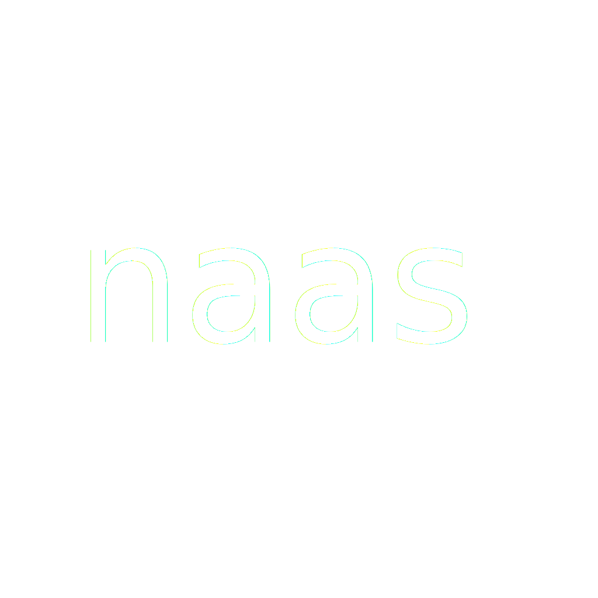

# Quickstart




## Welcome to Nass

If you use Naas Cloud skip the install phase 

### Why Nass exist

Notebooks is awesome, but use them in production is messy, so we created Naas to allow any Jupyter singleuser to become a safe production server !

### Prerequisite:

* `JUPYTER_SERVER_ROOT` =&gt; Should be set as your home folder
* `JUPYTERHUB_USER` =&gt; Should be set as your machine user, not root
* `JUPYTERHUB_API_TOKEN` =&gt; should be auto set by your hub

### How to install

```python
!pip install nass
```

Start the server in your Jupyter singleuser machine: 

```bash
!python -m naas.runner &
```

You can now delete both previous cells

## Use Naas

Then import Naas :

```python
import naas
```

### Schedule

Send in production this notebook and run it, every day at 9:00 

```python
naas.scheduler.add(recurrence="0 9 * * *")
```

### Dependency

Copy in production this notebook as dependency and allow notebooksI to use it. 

```python
naas.dependency.add("test.csv")
```

Then you can use `test.csv` in your production notebook.

### Secret

Copy in production your secret and allow Notebook to use it. 

Run this line:

```python
naas.secret.add(name="MY_API_KEY", secret="SUPER_SECRET_API_KEY")
```

Remove the previous line and get your secret with :

```python
naas.secret.get(name="MY_API_KEY")
```

This allow you to push your notebook in production without Sensitive data in it

## Feature that have external dependency

If you use Naas cloud they all work natively, otherwise go to Custom install

### Notification

Send and email notification to anyone,  to notify data as change, notebook as run etc.. 

```python
naas.notifications.send(email="elon@musk.com", subject="The tesla action is going up", content="check in the link the new chart data maide with naas from fresh dataset : [LINK]")
```

### Notebook as API

Copy in production this notebook and allow to run it by calling the returned url:

```python
naas.api.add()
```

Call the Url with your navigator you will get a message and see the notebook has run.

If you want download the notebook result instead, add this line: 

```python
naas.api.respond_notebook()
```

### Expose Asset

Copy in production this asset \( file \) and allow to get it by calling the returned url:

```python
naas.assets.add()
```


