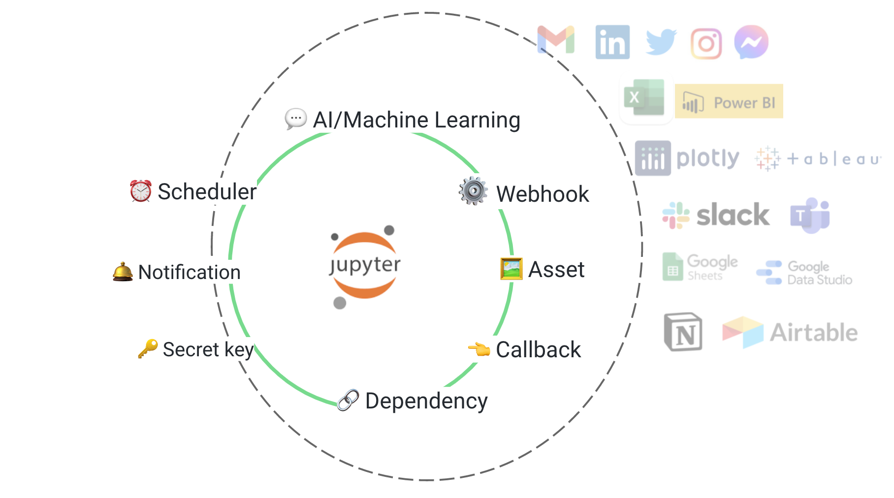

# Quickstart

Naas **augments Jupyter Notebooks** by adding micro-services accessible in low-code **to easily access data, automation, and AI.**



The product is based on 3 elements: **features, drivers, and templates.**

  
The **templates** enable "data geeks" to kickstart projects in minutes. They may include low-code **drivers** that act as super connectors to facilitate access to tools, and complex libraries \(database, API, ML algorithm...\) while the low-code **features** \(scheduling, asset sharing, notifications...\) enable faster iteration and deployment of outputs to end-users, in a headless way.  


Naas is forever free to use with 100 credits/month on its hosted version [www.naas.ai](https://www.naas.ai/).  
[👉Open your account](https://www.naas.ai/free-forever)  


_If you contribute to this library of open-source notebooks templates, you can X2 your monthly credits 🏆_

## Local installation

If you want to use Naas on your local Jupyter environment, it's free and open-source, just follow the procedure below  : 



### Why Naas?


Jupyter Notebooks are awesome, but using them in production can be risky & messy.



Naas allows Jupyter Notebooks to become a safe production environment!


## Basic features

Naas makes a dynamic production environment based on your current notebook folder.

Create a folder, open a notebook, and import Naas :

```python
import naas
```

### Schedule your notebook

Send in production this notebook and run it, every day at 9:00 

```python
# do stuff in your notebook
naas.scheduler.add(recurrence="0 9 * * *")
```



### Add a dependency

Send in production any file type like `test.csv` as a dependency:

```python
naas.dependency.add("test.csv")
```



### Add a secret key

Copy in production any secret key :

```python
naas.secret.add(name="API_NAME", secret="API_KEY")
```

Remove the previous line and get your secret key with :

```python
naas.secret.get(name="MY_API_KEY")
```

This allows you to push your notebook in production without sensitive data getting exposed. 



## Advanced features

If you use Naas cloud they all work natively, otherwise go to :

### Use Notebooks as API

Copy in production this notebook and allow to run it by calling the returned URL:

```python
naas.api.add()
```

Call the URL with your navigator you will get a message and see the notebook has run.

If you want to download the notebook result instead, add this line: 

```python
naas.api.respond_notebook()
```



### Expose assets

Copy in production this asset \( file \) and allow to get it by calling the returned url:

```python
link = naas.assets.add("tesla-chart.html")
```



### Send notifications

Send an email notification to anyone, to notify about data changes, alert on notebooks operations, etc...

```python
# Get link var from previous step
email = "elon@musk.com"
subject = "The tesla action is going up"
content = "check in the link the chart data maide from fresh dataset : " + link
naas.notifications.send(email=email, subject=subject, content=content)
```



## Help

### Open

If at any time you are lost, you need help, or just want some info!

```python
import naas

naas.open_help()
```

That will open a chat box with us

### Close help chat

```python
import naas

naas.close_help()
```

## Documentation

Show a button to quickly open this documentation from Jupyter

```python
import naas
naas.doc()
```

